# Markdown showcase

A comprehensive visual fixture for **Markdown**, **GitHub Flavored Markdown (GFM)**, **LaTeX math**, **Mermaid**, and common extensions. Examples are live so you can inspect how this viewer renders them.

**Support note:** Markdown has several dialects. Core syntax is broadly portable; math, diagrams, footnotes, alerts, HTML, and the optional extensions depend on the viewer. This document includes those probes without claiming this viewer supports every one. The YAML above is also a front-matter probe: some viewers interpret it as metadata, while others display it.

## Contents

- [Headings and paragraphs](#headings-and-paragraphs)
- [Inline formatting](#inline-formatting)
- [Links and references](#links-and-references)
- [Lists and tasks](#lists-and-tasks)
- [Quotes and alerts](#quotes-and-alerts)
- [Tables](#tables)
- [Code](#code)
- [Syntax highlighting gallery](#syntax-highlighting-gallery)
- [LaTeX mathematics](#latex-mathematics)
- [Mermaid diagrams](#mermaid-diagrams)
- [Images and media](#images-and-media)
- [Footnotes](#footnotes)
- [HTML and disclosure widgets](#html-and-disclosure-widgets)
- [Optional dialect extensions](#optional-dialect-extensions)
- [Escaping and edge cases](#escaping-and-edge-cases)
- [Combined rendering specimen](#combined-rendering-specimen)

## Headings and paragraphs

# Heading level 1

## Heading level 2

### Heading level 3

#### Heading level 4

##### Heading level 5

###### Heading level 6

Setext heading level 1
======================

Setext heading level 2
----------------------

### Paragraphs and line breaks

This is an ordinary paragraph. It contains a sentence that wraps naturally when the panel gets narrow, which is useful for checking comfortable line lengths and text flow beside wider elements.

This is a separate paragraph because a blank line separates it from the previous paragraph.

This source line has a soft break.
This next source line normally continues the same paragraph.

This line ends with two spaces for a hard break.  
This line should appear immediately below it.

This line ends with a backslash for a hard break.\
This line should also appear immediately below it.

### Thematic breaks

Three hyphens:

---

Three asterisks:

***

Three underscores:

___

## Inline formatting

| Feature | Live example |
| :--- | :--- |
| Emphasis with asterisks | *Italic text* |
| Emphasis with underscores | _Also italic_ |
| Strong with asterisks | **Bold text** |
| Strong with underscores | __Also bold__ |
| Strong emphasis | ***Bold and italic*** |
| Nested emphasis | **Bold with an *italic portion*** |
| Strikethrough, GFM | ~~Removed text~~ |
| Combined styles | ~~**Old important text**~~ and **new important text** |
| Inline code | `const answer = 42;` |
| Code containing a backtick | ``Use `code` inside code`` |
| Literal Markdown in code | `**This remains literal**` |
| Inline math, extension | $E = mc^2$ |
| Escaped punctuation | \*literal asterisks\* and \_literal underscores\_ |
| Unicode symbols | ✓ ✕ → ← ↔ ∞ ≈ ≤ ≥ © ® ™ |
| Unicode emoji | 🚀 🧪 📚 ✅ ⚠️ 🧑🏽‍💻 |
| HTML entities | &amp; &lt; &gt; &copy; &mdash; &hellip; |

Punctuation: “double quotes”, ‘single quotes’, an ellipsis…, and a nonbreaking space between these words: keep&nbsp;together.

## Links and references

- Inline link: [Example website](https://example.com).
- Link with a hover title: [Example with title](https://example.com "A link title").
- Formatting in a link: [**Bold link** with `code`](https://example.com).
- Explicit URL autolink: <https://example.com>.
- GFM bare URL autolink: https://example.com.
- Email autolink: <reader@example.com>.
- Email link: [Write to the sample address](mailto:reader@example.com).
- Full reference link: [Example reference][example-site].
- Collapsed reference link: [Reference destination][].
- Shortcut reference link: [Shortcut destination].
- Relative file link: [Fixture README](README.md).
- Local section link: [Jump to the math examples](#latex-mathematics).
- URL with query parameters: [Sample query](https://example.com/?q=markdown&view=full).

[example-site]: https://example.com "Reference-style destination"
[Reference destination]: https://example.com/reference
[Shortcut destination]: https://example.com/shortcut

## Lists and tasks

### Unordered markers

- Dash marker
- Another dash marker

* Asterisk marker
* Another asterisk marker

+ Plus marker
+ Another plus marker

### Nested mixed lists

- Project
  - Research
    - Read the specification
    - Collect examples
  - Implementation
    1. Parse the source
    2. Render the blocks
       - Preserve code whitespace
       - Keep tables readable
    3. Inspect the result
- Delivery
  - Save the file
  - Open the preview

### Ordered lists

1. First item
2. Second item
3. Third item

The source below starts at seven; the viewer should preserve that start:

7. Seventh item
8. Eighth item
9. Ninth item

Parenthesis delimiters are also valid list markers:

1) First item
2) Second item

### Loose lists with multiple blocks

1. **Read the input.**

   This paragraph belongs to the first item.

   > A blockquote can belong to the same item.

2. **Run a small transformation.**

   ```python
   values = [1, 2, 3]
   print([value * 2 for value in values])
   ```

3. **Inspect a nested table.**

   | Check | Result |
   | --- | --- |
   | Parse | Pass |
   | Render | Pass |

### Task lists, GFM

- [x] Write the document
- [x] Include rich content
- [ ] Inspect every section in the current viewer
  - [x] Include inline and display math
  - [x] Include several diagram types
  - [ ] Confirm optional extensions visually
- [ ] Check a very long task description that wraps onto another line while keeping its checkbox aligned with the first line of text in a narrow panel

1. [x] Completed ordered task
2. [ ] Pending ordered task

## Quotes and alerts

### Blockquotes

> A single-paragraph blockquote with **bold**, *italic*, and `inline code`.

> A quote with multiple paragraphs.
>
> The second paragraph stays inside the same quote.
>
> > A nested quotation.
> >
> > > A third level of quotation.
>
> - A list inside the quote
> - Another item
>
> ```text
> Code inside a blockquote.
> ```

### GitHub-style alerts, extension

> [!NOTE]
> Supplementary information with an [example link](https://example.com).

> [!TIP]
> Resize the right panel to inspect wrapping and horizontal scrolling.

> [!IMPORTANT]
> A diagram should render as a diagram when Mermaid is enabled.

> [!WARNING]
> This is sample warning content for testing the visual treatment.

> [!CAUTION]
> This is sample caution content with **strong emphasis**.

## Tables

### Alignment and basic cells

| Left aligned | Centered | Right aligned | Default |
| :--- | :---: | ---: | --- |
| Alpha | A | 1 | Plain text |
| Beta | B | 12.50 | **Bold** |
| Gamma | C | 1,234.56 | *Italic* |
| Delta | D | −42 | ~~Struck through~~ |

### Rich cells and escaped pipes

| Feature | Example | Notes |
| --- | --- | --- |
| Code | `user.name` | Inline code inside a cell |
| Literal pipe | left \| right | Escape the separator |
| Pipe inside code | `a \| b` | GFM table parsing happens before inline code parsing |
| Link | [Example](https://example.com) | Clickable cell content |
| Inline math | $\sqrt{x^2 + y^2}$ | Requires a math extension |
| Line breaks | First line<br>Second line<br>Third line | Requires inline HTML |
| Mixed emphasis | **Ready** with *one caveat* | Multiple inline nodes |
| Footnote | A measured result[^measurement] | Requires footnotes |
| Empty cell | | Intentionally blank |
| Special characters | &lt;tag&gt; &amp; © | Entities and Unicode |

### Wide report with long content

All figures in this table are fictional rendering samples.

| Service | Region | Owner | Status | Requests / day | Error rate | p50 (ms) | p95 (ms) | p99 (ms) | Cost / month | Notes |
| :--- | :--- | :--- | :---: | ---: | ---: | ---: | ---: | ---: | ---: | :--- |
| API gateway | us-west | Platform | ✅ | 12,450,000 | 0.02% | 18 | 71 | 143 | $420.00 | Handles public requests and forwards authenticated traffic |
| Search | eu-central | Discovery | ✅ | 4,280,000 | 0.08% | 32 | 112 | 230 | $310.25 | Supports filters, sorting, and full-text matching |
| Image processor | ap-south | Media | ⚠️ | 830,000 | 0.31% | 120 | 490 | 980 | $198.90 | A deliberately long note checks wrapping inside a wide table |
| Notifications | us-east | Messaging | ✅ | 2,100,000 | 0.01% | 11 | 36 | 92 | $84.75 | Email and in-app delivery |
| **Total / summary** | **4 regions** | **4 teams** | **3 ✅ / 1 ⚠️** | **19,660,000** | **Varies** | | | | **$1,013.90** | **Summary row with intentionally empty aggregate latency cells** |

### Dense feature matrix

| Syntax family | Text | Links | Code | Math | Nested blocks | Native Markdown? |
| --- | :---: | :---: | :---: | :---: | :---: | --- |
| Paragraph | ✓ | ✓ | ✓ | Extension | No | Yes |
| List item | ✓ | ✓ | ✓ | Extension | ✓ | Yes |
| Blockquote | ✓ | ✓ | ✓ | Extension | ✓ | Yes |
| GFM table cell | ✓ | ✓ | Inline | Extension | No | GFM extension |
| HTML table cell | HTML | HTML | HTML | Viewer-dependent | HTML | HTML passthrough |

### Merged headers and row spans, HTML extension

Pipe tables do not provide merged cells. This specimen uses an HTML table; its rendering depends on HTML support.

<table>
  <caption>Quarterly sample results with grouped column headers</caption>
  <thead>
    <tr><th rowspan="2">Team</th><th colspan="2">Q1</th><th colspan="2">Q2</th><th rowspan="2">Trend</th></tr>
    <tr><th>Planned</th><th>Delivered</th><th>Planned</th><th>Delivered</th></tr>
  </thead>
  <tbody>
    <tr><th rowspan="2">Platform</th><td>24</td><td>23</td><td>28</td><td>28</td><td>↗</td></tr>
    <tr><td colspan="4"><strong>Note:</strong> the second row spans all four metric columns.</td><td>✓</td></tr>
    <tr><th>Design</th><td>12</td><td>12</td><td>16</td><td>15</td><td>→</td></tr>
  </tbody>
  <tfoot>
    <tr><th>Total</th><td>36</td><td>35</td><td>44</td><td>43</td><td>↗</td></tr>
  </tfoot>
</table>

## Code

### Plain fenced block

```
No language hint is attached to this block.
    Indentation is preserved.
<tags> & **Markdown** remain literal.
```

### Indented code block

    This is an indented code block.
    It uses four leading spaces.
        Deeper indentation stays visible.

### Tilde fence

~~~text
A fenced block can use tildes.
Literal backticks: ```
~~~

### Nested fences and Markdown source

````markdown
## A heading shown as source

**Bold** and [a link](https://example.com).

```javascript
console.log("A triple fence inside a four-backtick fence");
```
````

### TypeScript

```typescript
type Result<T> =
  | { ok: true; value: T }
  | { ok: false; error: string };

function first<T>(items: readonly T[]): Result<T> {
  return items.length > 0
    ? { ok: true, value: items[0]! }
    : { ok: false, error: "Empty collection" };
}
```

### JavaScript

```javascript
const squares = Array.from({ length: 5 }, (_, i) => i ** 2);
console.log({ squares, total: squares.reduce((a, b) => a + b, 0) });
```

### JSX

```jsx
export function Badge({ children, active = false }) {
  return <span className={active ? "active" : "idle"}>{children}</span>;
}
```

### Python

```python
from dataclasses import dataclass

@dataclass(frozen=True)
class Point:
    x: float
    y: float

    def magnitude(self) -> float:
        return (self.x ** 2 + self.y ** 2) ** 0.5

print(Point(3, 4).magnitude())  # 5.0
```

### Swift

```swift
struct Greeting {
    let name: String

    var message: String {
        "Hello, \(name)!"
    }
}
```

### Rust

```rust
fn main() {
    let total: i32 = (1..=5).map(|n| n * n).sum();
    println!("Total: {total}");
}
```

### Shell

```bash
name="Markdown"
printf 'Hello, %s\n' "$name"
for item in alpha beta gamma; do
  printf '%s\n' "$item"
done
```

### JSON

```json
{
  "name": "markdown-showcase",
  "enabled": true,
  "count": 42,
  "tags": ["text", "math", "diagrams"],
  "metadata": null
}
```

### YAML

```yaml
document:
  title: Markdown showcase
  sections:
    - text
    - math
    - diagrams
  description: |
    A multiline string.
    Whitespace matters here.
```

### HTML and CSS

```html
<article class="card">
  <h2>A sample card</h2>
  <p>Source code stays visible inside a fence.</p>
</article>
```

```css
.card {
  display: grid;
  gap: 1rem;
  padding: clamp(1rem, 3vw, 2rem);
  border: 1px solid currentColor;
  border-radius: 12px;
}
```

### SQL

```sql
SELECT team, COUNT(*) AS completed
FROM tasks
WHERE status = 'done'
GROUP BY team
HAVING COUNT(*) > 3
ORDER BY completed DESC;
```

### Diff

```diff
 function greet(name) {
-  return "Hi " + name;
+  return `Hello, ${name}!`;
 }
```

### LaTeX source, distinct from rendered math

```latex
\int_0^1 x^2\,dx = \frac{1}{3}
```

### Long lines and whitespace

```text
https://example.com/a/very/long/path/designed/to/test/horizontal/scrolling/inside/a/code/block/without/changing/the/layout/of/the/rest/of/the/document?mode=preview&wrap=false&sample=abcdefghijklmnopqrstuvwxyz0123456789

column A      column B      column C
alpha         123           true
beta          456           false
```

## Syntax highlighting gallery

Short, illustrative snippets spanning programming languages, shells, templates, query languages, markup, and configuration formats. Each block has an explicit language identifier. This is a broad gallery, not an exhaustive inventory of every programming language or a verified list of this viewer's grammars. Unknown identifiers may render as plain code. Samples are for visual inspection and have not been executed or compiled.

### Inline backticks versus language fences

Single backticks create inline code: `echo "$HOME"`, `print("Hello")`, `let answer = 42`.

Double backticks allow an embedded backtick: ``const message = `Hello, ${name}!`;``.

Triple backticks create a block. The word after the opening fence selects a grammar, such as `bash`, `python`, or `swift`. Inline code has no portable language selector.

````markdown
```bash
printf 'Hello, %s\n' "Markdown"
```

```python
print("Hello, Markdown!")
```

```swift
print("Hello, Markdown!")
```
````

### Language index

| Language / format | Fence identifier |
| --- | --- |
| Bash | `bash` |
| POSIX shell | `sh` |
| Zsh | `zsh` |
| Fish | `fish` |
| PowerShell | `powershell` |
| Windows batch | `bat` |
| Nushell | `nu` |
| Python | `python` |
| JavaScript | `javascript` |
| TypeScript | `typescript` |
| TSX | `tsx` |
| JSX | `jsx` |
| CoffeeScript | `coffeescript` |
| Vue | `vue` |
| Svelte | `svelte` |
| Astro | `astro` |
| C | `c` |
| C++ | `cpp` |
| C# | `csharp` |
| F# | `fsharp` |
| Visual Basic .NET | `vb` |
| Java | `java` |
| Kotlin | `kotlin` |
| Scala | `scala` |
| Groovy | `groovy` |
| Swift | `swift` |
| Objective-C | `objective-c` |
| Objective-C++ | `objective-cpp` |
| Dart | `dart` |
| Go | `go` |
| Rust | `rust` |
| Zig | `zig` |
| D | `d` |
| V | `v` |
| Nim | `nim` |
| Crystal | `crystal` |
| Ruby | `ruby` |
| PHP | `php` |
| Perl | `perl` |
| Raku | `raku` |
| Lua | `lua` |
| Tcl | `tcl` |
| Awk | `awk` |
| Sed | `sed` |
| AppleScript | `applescript` |
| AutoHotkey | `autohotkey` |
| Haskell | `haskell` |
| OCaml | `ocaml` |
| Standard ML | `sml` |
| Elm | `elm` |
| PureScript | `purescript` |
| Reason | `reason` |
| ReScript | `rescript` |
| Erlang | `erlang` |
| Elixir | `elixir` |
| Gleam | `gleam` |
| Clojure | `clojure` |
| Common Lisp | `common-lisp` |
| Scheme | `scheme` |
| Racket | `racket` |
| Emacs Lisp | `emacs-lisp` |
| Julia | `julia` |
| R | `r` |
| MATLAB | `matlab` |
| Octave | `octave` |
| Fortran | `fortran` |
| SAS | `sas` |
| Stata | `stata` |
| Wolfram Language | `wolfram` |
| Ada | `ada` |
| COBOL | `cobol` |
| Pascal | `pascal` |
| Delphi | `delphi` |
| BASIC | `basic` |
| VBScript | `vbscript` |
| Prolog | `prolog` |
| Smalltalk | `smalltalk` |
| Eiffel | `eiffel` |
| Haxe | `haxe` |
| GDScript | `gdscript` |
| Processing | `processing` |
| Arduino | `arduino` |
| Solidity | `solidity` |
| Vyper | `vyper` |
| Move | `move` |
| Cairo | `cairo` |
| Yul | `yul` |
| GLSL | `glsl` |
| HLSL | `hlsl` |
| WGSL | `wgsl` |
| CUDA | `cuda` |
| OpenCL | `opencl` |
| Verilog | `verilog` |
| SystemVerilog | `systemverilog` |
| VHDL | `vhdl` |
| x86 assembly | `asm` |
| ARM assembly | `armasm` |
| WebAssembly text | `wasm` |
| LLVM IR | `llvm` |
| Forth | `forth` |
| APL | `apl` |
| J | `j` |
| BQN | `bqn` |
| Brainfuck | `brainfuck` |
| Befunge | `befunge` |
| Lean | `lean` |
| Coq | `coq` |
| Agda | `agda` |
| Idris | `idris` |
| LaTeX | `latex` |
| TeX | `tex` |
| Typst | `typst` |
| HTML | `html` |
| XML | `xml` |
| SVG | `svg` |
| CSS | `css` |
| SCSS | `scss` |
| Sass | `sass` |
| Less | `less` |
| Stylus | `stylus` |
| Markdown | `markdown` |
| MDX | `mdx` |
| reStructuredText | `rst` |
| AsciiDoc | `asciidoc` |
| Org mode | `org` |
| BBCode | `bbcode` |
| Handlebars | `handlebars` |
| Mustache | `mustache` |
| Jinja | `jinja` |
| Django templates | `django` |
| Twig | `twig` |
| Liquid | `liquid` |
| Pug | `pug` |
| Haml | `haml` |
| ERB | `erb` |
| Blade | `blade` |
| SQL | `sql` |
| PostgreSQL | `pgsql` |
| MySQL | `mysql` |
| PL/SQL | `plsql` |
| GraphQL | `graphql` |
| Prisma | `prisma` |
| Cypher | `cypher` |
| SPARQL | `sparql` |
| JSON | `json` |
| JSON with comments | `jsonc` |
| JSON5 | `json5` |
| YAML | `yaml` |
| TOML | `toml` |
| INI | `ini` |
| Java properties | `properties` |
| dotenv | `dotenv` |
| CSV | `csv` |
| TSV | `tsv` |
| Protocol Buffers | `protobuf` |
| Thrift | `thrift` |
| Cap'n Proto | `capnp` |
| FlatBuffers | `flatbuffers` |
| Avro IDL | `avdl` |
| Turtle RDF | `turtle` |
| BibTeX | `bibtex` |
| Dockerfile | `dockerfile` |
| Makefile | `makefile` |
| CMake | `cmake` |
| Meson | `meson` |
| Ninja | `ninja` |
| Just | `just` |
| Nix | `nix` |
| HCL | `hcl` |
| Terraform | `terraform` |
| CUE | `cue` |
| Dhall | `dhall` |
| Bicep | `bicep` |
| Puppet | `puppet` |
| Ansible | `ansible` |
| Nginx | `nginx` |
| Apache configuration | `apache` |
| systemd | `systemd` |
| SSH configuration | `ssh-config` |
| Desktop entry | `desktop` |
| HTTP | `http` |
| Regular expression | `regex` |
| Diff | `diff` |
| Git ignore | `gitignore` |
| Git commit message | `git-commit` |
| Git rebase todo | `git-rebase` |
| Log output | `log` |
| Graphviz DOT | `dot` |
| PlantUML | `plantuml` |
| Mermaid source, intentionally not rendered | `text` |
| Plain text fallback | `text` |
| Unregistered language fallback | `made-up-language` |

### Bash

```bash
#!/usr/bin/env bash
name="Markdown"
for item in alpha beta; do
  printf '%s: %s\n' "$name" "$item"
done
```

### POSIX shell

```sh
#!/bin/sh
name=${1:-world}
case "$name" in
  world) printf 'Hello, world\n' ;;
  *) printf 'Hello, %s\n' "$name" ;;
esac
```

### Zsh

```zsh
typeset -a colors=(red green blue)
for color in $colors; do
  print -P "%F{${color}}${color}%f"
done
```

### Fish

```fish
set name Markdown
for item in alpha beta
    printf '%s: %s\n' $name $item
end
```

### PowerShell

```powershell
param([string]$Name = 'Markdown')
1..3 | ForEach-Object {
    Write-Output "Hello, $Name #$_"
}
```

### Windows batch

```bat
@echo off
set "NAME=Markdown"
for %%N in (1 2 3) do (
  echo Hello, %NAME% %%N
)
```

### Nushell

```nu
let people = [{name: Ada, score: 98}, {name: Lin, score: 87}]
$people | where score > 90 | select name score
```

### Python

```python
from dataclasses import dataclass
@dataclass
class User:
    name: str
    active: bool = True
print(f"Hello, {User('Ada').name}")
```

### JavaScript

```javascript
const greet = (name = "world") => `Hello, ${name}!`;
const names = ["Ada", "Lin"].filter(name => name.length > 2);
console.log(names.map(greet)); // two greetings
```

### TypeScript

```typescript
type User = { id: number; name: string };
const greet = ({ name }: User): string => `Hello, ${name}!`;
console.log(greet({ id: 1, name: "Ada" }));
```

### TSX

```tsx
type Props = { count: number };
export function Counter({ count }: Props) {
  return <button aria-label="Count">Total: {count}</button>;
}
```

### JSX

```jsx
export function Greeting({ name = "world" }) {
  return <section className="greeting">Hello, {name}!</section>;
}
```

### CoffeeScript

```coffeescript
square = (x) -> x * x
numbers = [1, 2, 3]
console.log (square n for n in numbers)
```

### Vue

```vue
<script setup lang="ts">
import { ref } from 'vue';
const count = ref(0);
</script>
<template><button @click="count++">{{ count }}</button></template>
```

### Svelte

```svelte
<script>
  let name = 'world';
</script>
<h1>Hello, {name}!</h1>
<style>h1 { color: rebeccapurple; }</style>
```

### Astro

```astro
---
const title = 'Markdown';
---
<section><h1>{title}</h1></section>
<style>h1 { color: teal; }</style>
```

### C

```c
#include <stdio.h>
int main(void) {
    const int answer = 42;
    printf("Answer: %d\n", answer);
    return 0;
}
```

### C++

```cpp
#include <iostream>
#include <vector>
int main() {
    for (const auto n : std::vector<int>{1, 2, 3})
        std::cout << n * n << '\n';
}
```

### C#

```csharp
using System;
record User(string Name, int Score);
class Program {
    static void Main() => Console.WriteLine(new User("Ada", 98));
}
```

### F#

```fsharp
let square x = x * x
let values = [1; 2; 3] |> List.map square
printfn "Squares: %A" values
```

### Visual Basic .NET

```vb
Module Program
    Sub Main()
        Dim name As String = "Markdown"
        Console.WriteLine($"Hello, {name}!")
    End Sub
End Module
```

### Java

```java
public class Main {
    public static void main(String[] args) {
        var name = "Markdown";
        System.out.println("Hello, " + name);
    }
}
```

### Kotlin

```kotlin
data class User(val name: String, val score: Int)
fun main() {
    val user = User("Ada", 98)
    println("${user.name}: ${user.score}")
}
```

### Scala

```scala
case class User(name: String, score: Int)
object Main extends App {
  val user = User("Ada", 98)
  println(s"${user.name}: ${user.score}")
}
```

### Groovy

```groovy
def users = ['Ada', 'Lin']
users.each { name ->
    println "Hello, ${name}!"
}
```

### Swift

```swift
struct User {
    let name: String
    var greeting: String { "Hello, \(name)!" }
}
print(User(name: "Ada").greeting)
```

### Objective-C

```objective-c
#import <Foundation/Foundation.h>
int main(void) {
    @autoreleasepool {
        NSLog(@"Hello, %@!", @"Markdown");
    }
}
```

### Objective-C++

```objective-cpp
#import <Foundation/Foundation.h>
#include <vector>
void showCount() {
    std::vector<int> values{1, 2, 3};
    NSLog(@"Count: %lu", (unsigned long)values.size());
}
```

### Dart

```dart
void main() {
  final names = <String>['Ada', 'Lin'];
  for (final name in names) {
    print('Hello, $name!');
  }
}
```

### Go

```go
package main
import "fmt"
func main() {
    values := []int{1, 2, 3}
    for _, n := range values { fmt.Println(n * n) }
}
```

### Rust

```rust
#[derive(Debug)]
struct User { name: String }
fn main() {
    let user = User { name: "Ada".into() };
    println!("Hello, {}!", user.name);
}
```

### Zig

```zig
const std = @import("std");
pub fn main() void {
    const answer: u32 = 42;
    std.debug.print("Answer: {d}\n", .{answer});
}
```

### D

```d
import std.stdio;
void main() {
    immutable name = "Markdown";
    writeln("Hello, ", name);
}
```

### V

```v
fn main() {
    names := ['Ada', 'Lin']
    for name in names {
        println('Hello, ${name}!')
    }
}
```

### Nim

```nim
proc greet(name: string): string =
  "Hello, " & name & "!"
for name in ["Ada", "Lin"]:
  echo greet(name)
```

### Crystal

```crystal
class Greeter
  def initialize(@name : String); end
  def message
    "Hello, #{@name}!"
  end
end
puts Greeter.new("Ada").message
```

### Ruby

```ruby
User = Struct.new(:name, keyword_init: true)
user = User.new(name: "Ada")
puts "Hello, #{user.name}!" if user.name
```

### PHP

```php
<?php
function greet(string $name): string {
    return "Hello, {$name}!";
}
echo greet("Markdown");
```

### Perl

```perl
use strict;
use warnings;
my @names = qw(Ada Lin);
for my $name (@names) {
    print "Hello, $name!\n";
}
```

### Raku

```raku
sub greet(Str $name --> Str) {
    "Hello, $name!"
}
say greet($_) for <Ada Lin>;
```

### Lua

```lua
local function greet(name)
  return "Hello, " .. name .. "!"
end
for _, name in ipairs({"Ada", "Lin"}) do
  print(greet(name))
end
```

### Tcl

```tcl
proc greet {name} {
    return "Hello, $name!"
}
foreach name {Ada Lin} {
    puts [greet $name]
}
```

### Awk

```awk
BEGIN { FS = ","; total = 0 }
NR > 1 { total += $2 }
END { printf "Total: %.2f\n", total }
```

### Sed

```sed
# Trim leading and trailing spaces, then remove blank lines.
s/^[[:space:]]*//
s/[[:space:]]*$//
/^$/d
```

### AppleScript

```applescript
-- Source example only; this is not executed.
on greet(personName)
    return "Hello, " & personName & "!"
end greet
greet("Markdown")
```

### AutoHotkey

```autohotkey
#Requires AutoHotkey v2.0
greet(name) {
    return "Hello, " name "!"
}
MsgBox greet("Markdown")
```

### Haskell

```haskell
square :: Int -> Int
square x = x * x
main :: IO ()
main = print $ map square [1, 2, 3]
```

### OCaml

```ocaml
type user = { name : string; score : int }
let greet user = Printf.sprintf "Hello, %s!" user.name
let () = print_endline (greet { name = "Ada"; score = 98 })
```

### Standard ML

```sml
fun square x = x * x;
val values = List.map square [1, 2, 3];
val _ = print (Int.toString (List.foldl op+ 0 values) ^ "\n");
```

### Elm

```elm
module Main exposing (main)
import Html exposing (text)
greet name = "Hello, " ++ name ++ "!"
main = text (greet "Markdown")
```

### PureScript

```purescript
module Main where
import Prelude
import Effect (Effect)
import Effect.Console (log)
main :: Effect Unit
main = log "Hello, Markdown!"
```

### Reason

```reason
let square = (x: int): int => x * x;
let values = List.map(square, [1, 2, 3]);
List.iter(x => print_endline(string_of_int(x)), values);
```

### ReScript

```rescript
type user = {name: string, score: int}
let greet = user => "Hello, " ++ user.name ++ "!"
Js.log(greet({name: "Ada", score: 98}))
```

### Erlang

```erlang
-module(greeting).
-export([greet/1]).
greet(Name) ->
    io:format("Hello, ~s!~n", [Name]).
```

### Elixir

```elixir
defmodule Greeter do
  def greet(name), do: "Hello, #{name}!"
end
["Ada", "Lin"] |> Enum.map(&Greeter.greet/1) |> IO.inspect()
```

### Gleam

```gleam
import gleam/io
pub fn main() {
  let name = "Markdown"
  io.println("Hello, " <> name <> "!")
}
```

### Clojure

```clojure
(defn greet [name]
  (str "Hello, " name "!"))
(doseq [name ["Ada" "Lin"]]
  (println (greet name)))
```

### Common Lisp

```common-lisp
(defun square (x) (* x x))
(let ((values '(1 2 3)))
  (format t "~a~%" (mapcar #'square values)))
```

### Scheme

```scheme
(define (square x) (* x x))
(display (map square '(1 2 3)))
(newline)
```

### Racket

```racket
#lang racket
(define (greet name)
  (format "Hello, ~a!" name))
(for ([name '("Ada" "Lin")])
  (displayln (greet name)))
```

### Emacs Lisp

```emacs-lisp
(defun greet (name)
  "Return a greeting for NAME."
  (format "Hello, %s!" name))
(message "%s" (greet "Markdown"))
```

### Julia

```julia
struct User
    name::String
    score::Int
end
user = User("Ada", 98)
println("$(user.name): $(user.score)")
```

### R

```r
scores <- c(91, 98, 87)
summary <- data.frame(mean = mean(scores), sd = sd(scores))
print(summary)
```

### MATLAB

```matlab
x = linspace(0, 2*pi, 100);
y = sin(x);
plot(x, y, 'LineWidth', 2);
title('Sine wave');
```

### Octave

```octave
values = [1, 2, 3];
squares = values .^ 2;
for n = squares
  printf('%d\n', n);
endfor
```

### Fortran

```fortran
program hello
  implicit none
  integer :: i
  do i = 1, 3
    print *, i * i
  end do
end program hello
```

### SAS

```sas
data squares;
  do x = 1 to 3;
    y = x**2;
    output;
  end;
run;
```

### Stata

```stata
clear
set obs 3
generate x = _n
generate square = x^2
summarize square
```

### Wolfram Language

```wolfram
square[x_] := x^2
values = square /@ Range[5];
Total[values]
Plot[Sin[x], {x, 0, 2 Pi}]
```

### Ada

```ada
with Ada.Text_IO; use Ada.Text_IO;
procedure Hello is
begin
   Put_Line ("Hello, Markdown!");
end Hello;
```

### COBOL

```cobol
       IDENTIFICATION DIVISION.
       PROGRAM-ID. HELLO.
       PROCEDURE DIVISION.
           DISPLAY "Hello, Markdown!"
           STOP RUN.
```

### Pascal

```pascal
program Hello;
var name: string;
begin
  name := 'Markdown';
  WriteLn('Hello, ', name, '!');
end.
```

### Delphi

```delphi
program Hello;
{$APPTYPE CONSOLE}
uses System.SysUtils;
begin
  Writeln(Format('Hello, %s!', ['Markdown']));
end.
```

### BASIC

```basic
10 REM A SMALL COUNTING LOOP
20 FOR I = 1 TO 3
30 PRINT I * I
40 NEXT I
50 END
```

### VBScript

```vbscript
Function Greet(name)
    Greet = "Hello, " & name & "!"
End Function
WScript.Echo Greet("Markdown")
```

### Prolog

```prolog
parent(ada, lin).
parent(lin, sam).
ancestor(X, Y) :- parent(X, Y).
ancestor(X, Y) :- parent(X, Z), ancestor(Z, Y).
```

### Smalltalk

```smalltalk
| numbers squares |
numbers := #(1 2 3).
squares := numbers collect: [ :each | each squared ].
Transcript show: squares printString; cr.
```

### Eiffel

```eiffel
class HELLO
create make
feature
    make
        do
            print ("Hello, Markdown!%N")
        end
end
```

### Haxe

```haxe
class Main {
  static function main() {
    var names = ["Ada", "Lin"];
    for (name in names) trace('Hello, $name!');
  }
}
```

### GDScript

```gdscript
extends Node
@export var player_name: String = "Ada"
func _ready() -> void:
    print("Hello, %s!" % player_name)
```

### Processing

```processing
void setup() {
  size(320, 200);
  background(24);
  fill(160, 120, 255);
  ellipse(width / 2, height / 2, 80, 80);
}
```

### Arduino

```arduino
const int led = LED_BUILTIN;
void setup() { pinMode(led, OUTPUT); }
void loop() {
  digitalWrite(led, HIGH);
  delay(500);
  digitalWrite(led, LOW);
  delay(500);
}
```

### Solidity

```solidity
// SPDX-License-Identifier: MIT
pragma solidity ^0.8.0;
contract Counter {
    uint256 public count;
    function increment() external { count += 1; }
}
```

### Vyper

```vyper
count: public(uint256)
@external
def increment():
    self.count += 1
```

### Move

```move
module 0x1::greeting {
    public fun answer(): u64 {
        42
    }
}
```

### Cairo

```cairo
fn square(x: felt252) -> felt252 {
    x * x
}
fn main() {
    let result = square(7);
}
```

### Yul

```yul
{
    let result := add(20, 22)
    mstore(0x00, result)
    return(0x00, 0x20)
}
```

### GLSL

```glsl
#version 330 core
out vec4 color;
uniform float time;
void main() {
    color = vec4(0.5 + 0.5 * sin(time), 0.4, 0.8, 1.0);
}
```

### HLSL

```hlsl
float4 main(float4 position : SV_POSITION) : SV_TARGET {
    float shade = saturate(position.x / 640.0);
    return float4(shade, 0.4, 0.8, 1.0);
}
```

### WGSL

```wgsl
@fragment
fn main() -> @location(0) vec4<f32> {
  let tint = vec3<f32>(0.6, 0.4, 0.9);
  return vec4<f32>(tint, 1.0);
}
```

### CUDA

```cuda
__global__ void square(float* values, int count) {
    int i = blockIdx.x * blockDim.x + threadIdx.x;
    if (i < count) values[i] *= values[i];
}
```

### OpenCL

```opencl
__kernel void square(__global float* values) {
    const size_t i = get_global_id(0);
    values[i] *= values[i];
}
```

### Verilog

```verilog
module counter(input clk, input reset, output reg [7:0] count);
  always @(posedge clk)
    if (reset) count <= 0;
    else count <= count + 1;
endmodule
```

### SystemVerilog

```systemverilog
module counter(input logic clk, rst, output logic [7:0] count);
  always_ff @(posedge clk)
    if (rst) count <= '0;
    else count <= count + 1'b1;
endmodule
```

### VHDL

```vhdl
library ieee;
use ieee.std_logic_1164.all;
entity inverter is
  port (a : in std_logic; y : out std_logic);
end inverter;
architecture rtl of inverter is
begin
  y <= not a;
end rtl;
```

### x86 assembly

```asm
section .text
global add_two
add_two:
    mov eax, edi
    add eax, esi
    ret
```

### ARM assembly

```armasm
.text
.global add_two
add_two:
    add x0, x0, x1
    ret
```

### WebAssembly text

```wasm
(module
  (func (export "add") (param $a i32) (param $b i32) (result i32)
    local.get $a
    local.get $b
    i32.add))
```

### LLVM IR

```llvm
define i32 @add(i32 %a, i32 %b) {
entry:
  %sum = add i32 %a, %b
  ret i32 %sum
}
```

### Forth

```forth
: square ( n -- n*n ) dup * ;
5 square .
cr
```

### APL

```apl
numbers ← ⍳5
squares ← numbers * 2
+/squares
```

### J

```j
square =: *:
values =: 1 2 3 4 5
+/ square values
```

### BQN

```bqn
Square ← {𝕩 × 𝕩}
values ← 1‿2‿3‿4‿5
+´ Square¨ values
```

### Brainfuck

```brainfuck
++++++++[>++++++++<-]>+.
```

### Befunge

```befunge
"olleH",,,,,@
```

### Lean

```lean
def square (n : Nat) : Nat := n * n
theorem add_zero_example (n : Nat) : n + 0 = n := by
  simp
#eval square 7
```

### Coq

```coq
Definition square (n : nat) := n * n.
Theorem add_zero_example : forall n : nat, n + 0 = n.
Proof.
  intro n. apply Nat.add_0_r.
Qed.
```

### Agda

```agda
module Example where
open import Agda.Builtin.Nat
square : Nat → Nat
square n = n * n
```

### Idris

```idris
module Main
square : Integer -> Integer
square x = x * x
main : IO ()
main = printLn (square 7)
```

### LaTeX

```latex
\begin{align}
  f(x) &= x^2 + 2x + 1 \\
       &= (x + 1)^2
\end{align}
```

### TeX

```tex
\def\greet#1{Hello, #1!}
\greet{Markdown}
$$ \int_0^1 x^2\,dx = {1\over3} $$
\bye
```

### Typst

```typst
#set text(size: 11pt)
= A sample document
Hello, *Markdown*.
$ sum_(k=1)^n k = (n(n+1))/2 $
```

### HTML

```html
<!doctype html>
<html lang="en">
  <body><button class="primary" disabled>Save</button></body>
</html>
```

### XML

```xml
<?xml version="1.0" encoding="UTF-8"?>
<users>
  <user id="1" active="true"><name>Ada</name></user>
</users>
```

### SVG

```svg
<svg xmlns="http://www.w3.org/2000/svg" viewBox="0 0 100 100">
  <circle cx="50" cy="50" r="40" fill="#a78bfa" />
</svg>
```

### CSS

```css
:root { --accent: #7c3aed; }
.card:hover {
  color: var(--accent);
  transform: translateY(-2px);
}
```

### SCSS

```scss
$accent: #7c3aed;
.card {
  color: $accent;
  &:hover { color: lighten($accent, 10%); }
}
```

### Sass

```sass
$accent: #7c3aed
.card
  color: $accent
  &:hover
    opacity: 0.8
```

### Less

```less
@accent: #7c3aed;
.card {
  color: @accent;
  &:hover { color: lighten(@accent, 10%); }
}
```

### Stylus

```stylus
accent = #7c3aed
.card
  color accent
  &:hover
    opacity .8
```

### Markdown

```markdown
# Example heading
**Bold**, *italic*, and `inline code`.
- [x] A finished task
- [ ] A pending task
[Example](https://example.com)
```

### MDX

```mdx
import Badge from './Badge.jsx'
# A component in a document
<Badge tone="success">Ready</Badge>
The result is **available**.
```

### reStructuredText

```rst
Example heading
===============
A **bold** word and an ``inline literal``.
.. note::
   This is a sample note.
```

### AsciiDoc

```asciidoc
= Sample document
:toc:
== Introduction
A *bold* word and a `literal`.
NOTE: A sample note.
```

### Org mode

```org
* Sample heading
** Tasks
- [X] Write the example
- [ ] Inspect the preview
A *bold* word and ~inline code~.
```

### BBCode

```bbcode
[b]Bold text[/b]
[i]Italic text[/i]
[url=https://example.com]Example link[/url]
```

### Handlebars

```handlebars
<ul>
{{#each users}}
  <li>{{name}}</li>
{{else}}
  <li>No users</li>
{{/each}}
</ul>
```

### Mustache

```mustache
<h1>Hello, {{name}}!</h1>
{{#items}}<p>{{title}}</p>{{/items}}
{{^items}}<p>No items</p>{{/items}}
```

### Jinja

```jinja

  <p>{{ user.name | upper }}</p>

  <p>No users</p>

```

### Django templates

```django


  <h1>{{ title|default:"Welcome" }}</h1>

```

### Twig

```twig

  <li class="{{ loop.first ? 'first' : '' }}">{{ item.name }}</li>

```

### Liquid

```liquid

<h1>{{ title | upcase }}</h1>
<p>{{ item.title }}</p>
```

### Pug

```pug
doctype html
html
  body
    h1 Hello, #{name}!
    ul
      each item in items
        li= item.title
```

### Haml

```haml
%section.card
  %h1= title
  - items.each do |item|
    %p= item.name
```

### ERB

```erb
<h1><%= title %></h1>
<% users.each do |user| %>
  <p><%= user.name %></p>
<% end %>
```

### Blade

```blade
<h1>{{ $title }}</h1>
@foreach ($users as $user)
  <p>{{ $user->name }}</p>
@endforeach
```

### SQL

```sql
SELECT team, COUNT(*) AS total
FROM users
WHERE active = TRUE
GROUP BY team
ORDER BY total DESC;
```

### PostgreSQL

```pgsql
SELECT date_trunc('day', created_at) AS day,
       count(*) FILTER (WHERE active) AS active_count
FROM users
GROUP BY 1;
```

### MySQL

```mysql
SELECT `team`, COUNT(*) AS `total`
FROM `users`
WHERE `active` = 1
GROUP BY `team`
LIMIT 10;
```

### PL/SQL

```plsql
DECLARE
  greeting VARCHAR2(40) := 'Hello, Markdown!';
BEGIN
  DBMS_OUTPUT.PUT_LINE(greeting);
END;
/
```

### GraphQL

```graphql
query UserById($id: ID!) {
  user(id: $id) {
    id
    name
    posts(limit: 3) { title }
  }
}
```

### Prisma

```prisma
model User {
  id    Int    @id @default(autoincrement())
  email String @unique
  name  String?
}
```

### Cypher

```cypher
MATCH (a:Person)-[:KNOWS]->(b:Person)
WHERE a.name = 'Ada'
RETURN b.name AS friend
ORDER BY friend;
```

### SPARQL

```sparql
PREFIX ex: <https://example.com/>
SELECT ?name WHERE {
  ?person a ex:Person ; ex:name ?name .
}
ORDER BY ?name
```

### JSON

```json
{
  "name": "Ada",
  "active": true,
  "score": 98.5,
  "tags": ["example", "reader"],
  "metadata": null
}
```

### JSON with comments

```jsonc
{
  // This dialect permits comments.
  "enabled": true,
  "count": 42
}
```

### JSON5

```json5
{
  // Unquoted keys and trailing commas.
  name: 'Markdown',
  values: [1, 2, 3,],
}
```

### YAML

```yaml
defaults: &defaults
  enabled: true
  retries: 3
preview:
  <<: *defaults
  title: "Markdown"
```

### TOML

```toml
[document]
title = "Markdown"
enabled = true
tags = ["text", "math"]
[preview]
width = 960
```

### INI

```ini
[document]
title=Markdown
enabled=true
; A comment
width=960
```

### Java properties

```properties
# Example settings
app.name=Markdown
app.enabled=true
app.greeting=Hello\ world
```

### dotenv

```dotenv
# Public sample settings
APP_NAME="Markdown"
PORT=3000
LOG_LEVEL=debug
```

### CSV

```csv
name,score,active
Ada,98,true
Lin,87,false
"A name, with comma",92,true
```

### TSV

```tsv
name	score	active
Ada	98	true
Lin	87	false
```

### Protocol Buffers

```protobuf
syntax = "proto3";
message User {
  int32 id = 1;
  string name = 2;
  repeated string tags = 3;
}
```

### Thrift

```thrift
struct User {
  1: required i32 id,
  2: required string name,
  3: optional list<string> tags
}
```

### Cap'n Proto

```capnp
@0xdbb9ad1f14bf0b36;
struct User {
  id @0 :UInt32;
  name @1 :Text;
}
```

### FlatBuffers

```flatbuffers
namespace Example;
table User {
  id:uint;
  name:string;
}
root_type User;
```

### Avro IDL

```avdl
@namespace("example")
protocol Users {
  record User {
    long id;
    string name;
  }
}
```

### Turtle RDF

```turtle
@prefix ex: <https://example.com/> .
ex:ada a ex:Person ;
    ex:name "Ada" ;
    ex:score 98 .
```

### BibTeX

```bibtex
@misc{sample2026,
  author = {Example, Ada},
  title = {A Fictional Rendering Sample},
  year = {2026}
}
```

### Dockerfile

```dockerfile
FROM alpine:3.20
WORKDIR /app
COPY hello.sh .
RUN chmod +x hello.sh
CMD ["./hello.sh"]
```

### Makefile

```makefile
.PHONY: greet
NAME ?= Markdown
greet:
	@printf 'Hello, %s\n' "$(NAME)"
```

### CMake

```cmake
cmake_minimum_required(VERSION 3.20)
project(Hello LANGUAGES CXX)
add_executable(hello main.cpp)
target_compile_features(hello PRIVATE cxx_std_20)
```

### Meson

```meson
project('hello', 'c', version: '1.0.0')
executable('hello', 'main.c', install: false)
```

### Ninja

```ninja
rule cc
  command = cc -c $in -o $out
  description = CC $out
build main.o: cc main.c
```

### Just

```just
name := "Markdown"
greet:
    @echo "Hello, {{name}}!"
```

### Nix

```nix
let
  name = "Markdown";
  greet = person: "Hello, ${person}!";
in {
  message = greet name;
  enabled = true;
}
```

### HCL

```hcl
variable "app_name" {
  type    = string
  default = "markdown"
}
locals {
  label = "preview-${var.app_name}"
}
```

### Terraform

```terraform
terraform {
  required_version = ">= 1.0"
}
variable "name" {
  type    = string
  default = "markdown"
}
output "greeting" { value = "Hello, ${var.name}!" }
```

### CUE

```cue
#User: {
  name: string
  score: int & >=0 & <=100
}
ada: #User & {name: "Ada", score: 98}
```

### Dhall

```dhall
let User = { name : Text, active : Bool }
let ada : User = { name = "Ada", active = True }
in ada
```

### Bicep

```bicep
param appName string = 'markdown'
var greeting = 'Hello, ${appName}!'
output message string = greeting
```

### Puppet

```puppet
$greeting = 'Hello, Markdown!'
notify { 'sample':
  message => $greeting,
}
```

### Ansible

```ansible
- name: Print a greeting
  hosts: localhost
  gather_facts: false
  tasks:
    - ansible.builtin.debug:
        msg: "Hello, Markdown!"
```

### Nginx

```nginx
server {
    listen 8080;
    server_name localhost;
    location /health {
        return 200 "ok\n";
    }
}
```

### Apache configuration

```apache
<VirtualHost *:8080>
    ServerName localhost
    DocumentRoot /var/www/html
    <Directory /var/www/html>
        Require all granted
    </Directory>
</VirtualHost>
```

### systemd

```systemd
[Unit]
Description=Example greeting
[Service]
Type=oneshot
ExecStart=/usr/bin/printf "Hello, Markdown!\n"
```

### SSH configuration

```ssh-config
Host example
    HostName example.com
    User reader
    Port 22
    ServerAliveInterval 30
```

### Desktop entry

```desktop
[Desktop Entry]
Type=Application
Name=Markdown Example
Exec=example-viewer
Terminal=false
```

### HTTP

```http
GET /documents/42 HTTP/1.1
Host: example.com
Accept: application/json

HTTP/1.1 200 OK
Content-Type: application/json

{"title":"Markdown"}
```

### Regular expression

```regex
^(?<name>[A-Za-z][A-Za-z0-9_-]{2,31})@(?<host>[a-z0-9.-]+)\.(com|org|net)$
```

### Diff

```diff
--- a/greeting.txt
+++ b/greeting.txt
@@ -1,2 +1,2 @@
-Hello, world!
+Hello, Markdown!
 Ready.
```

### Git ignore

```gitignore
# Generated files
node_modules/
*.log
.env*
!.env.example
```

### Git commit message

```git-commit
Add Markdown rendering examples

Include tables, math, and language-specific fenced code blocks.

# Lines beginning with # are comments.
```

### Git rebase todo

```git-rebase
pick 1234abc Add example document
reword 5678def Improve the introduction
squash 90abcde Add another table
```

### Log output

```log
2026-10-03T12:00:00Z INFO  preview Document opened
2026-10-03T12:00:01Z DEBUG parser  Parsed 42 blocks
2026-10-03T12:00:02Z WARN  diagram Optional syntax unavailable
2026-10-03T12:00:03Z ERROR image   Sample error message
```

### Graphviz DOT

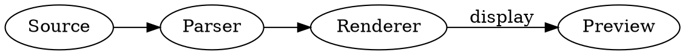

### PlantUML

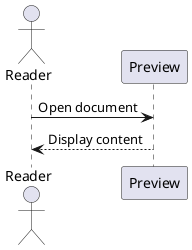

### Mermaid source, intentionally not rendered

```text
flowchart LR
    A[Source] --> B[Parser]
    B --> C[Preview]
```

### Plain text fallback

```text
Keywords: if else return class function
Numbers: 42 3.14 0xff
Strings: "hello" 'world'
Punctuation: {} [] () => :: ;
```

### Unregistered language fallback

```made-up-language
# This identifier intentionally has no standard grammar.
function greet(name) {
    return "Hello, " + name;
}
```

## LaTeX mathematics

These are math expressions embedded in Markdown, so they stay in this document rather than becoming a standalone LaTeX project. Dollar-delimited rendering requires a math extension.

### Inline expressions

The identity $e^{i\pi}+1=0$ fits inside a sentence. Subscripts $x_i$, superscripts $x^2$, Greek letters $\alpha,\beta,\gamma$, fractions $\frac{a}{b}$, and roots $\sqrt[n]{x}$ can also appear inline.

### Display equation

$$
x = \frac{-b \pm \sqrt{b^2 - 4ac}}{2a}
$$

### Aligned derivation

$$
\begin{aligned}
(a+b)^2
  &= (a+b)(a+b) \\
  &= a^2 + ab + ba + b^2 \\
  &= a^2 + 2ab + b^2.
\end{aligned}
$$

### Matrices, vectors, and determinants

$$
A = \begin{pmatrix}
1 & 2 & 3 \\
4 & 5 & 6 \\
7 & 8 & 9
\end{pmatrix},
\qquad
\mathbf{v} = \begin{bmatrix}x\\y\\z\end{bmatrix},
\qquad
\det\begin{pmatrix}a&b\\c&d\end{pmatrix}=ad-bc.
$$

### Piecewise function

$$
\operatorname{ReLU}(x) =
\begin{cases}
0, & x < 0, \\
x, & x \ge 0.
\end{cases}
$$

### Sums, products, and limits

$$
\sum_{k=1}^{n} k = \frac{n(n+1)}{2},
\qquad
\prod_{k=1}^{n} k = n!,
\qquad
\lim_{n\to\infty}\left(1+\frac{1}{n}\right)^n=e.
$$

### Calculus

$$
\int_{-\infty}^{\infty} e^{-x^2}\,dx = \sqrt{\pi},
\qquad
\frac{d}{dx}\sin x = \cos x,
\qquad
\nabla f = \left(\frac{\partial f}{\partial x},\frac{\partial f}{\partial y}\right).
$$

### Probability and expectations

$$
P(A\mid B)=\frac{P(B\mid A)P(A)}{P(B)},
\qquad
\mathbb{E}[X]=\sum_x x\,P(X=x),
\qquad
\operatorname{Var}(X)=\mathbb{E}[X^2]-\mathbb{E}[X]^2.
$$

### Sets and logic

$$
A\cup B=\{x\mid x\in A\lor x\in B\},
\qquad
\forall x\in\mathbb{R},\quad x^2\ge0,
\qquad
A\subseteq B\iff A\cap B=A.
$$

### Accents, braces, annotations, and boxes

$$
\hat{\theta},\quad \bar{x},\quad \vec{v},\quad
\underbrace{x_1+\cdots+x_n}_{n\text{ terms}},\quad
\overbrace{a+b}^{\text{group}},\quad
\boxed{\mathcal{L}=\mathcal{L}_{\mathrm{data}}+\lambda\mathcal{L}_{\mathrm{reg}}}.
$$

### A structured array

$$
\begin{array}{c|ccc}
x & 0 & 1 & 2 \\
\hline
x^2 & 0 & 1 & 4 \\
2^x & 1 & 2 & 4
\end{array}
$$

### Larger multiline expression

$$
\begin{aligned}
\operatorname{Attention}(Q,K,V)
&= \operatorname{softmax}\!\left(\frac{QK^\top}{\sqrt{d_k}}\right)V, \\
\operatorname{softmax}(z)_i
&= \frac{\exp(z_i)}{\sum_{j=1}^{m}\exp(z_j)}.
\end{aligned}
$$

### Alternative math delimiters, viewer-dependent

Parenthesis delimiters: \( a^2+b^2=c^2 \).

\[
\frac{1}{1-x}=\sum_{n=0}^{\infty}x^n,\qquad |x|<1.
\]

Some viewers also recognize a `math` fence:

```math
f(x)=\int_0^x t^2\,dt=\frac{x^3}{3}
```

## Mermaid diagrams

Each block uses the `mermaid` language identifier. Rendering and diagram availability depend on the viewer and its bundled Mermaid version; a plain code block means the diagram was not rendered. Diagram data is fictional.

### Flowchart with decisions, a subgraph, and styling

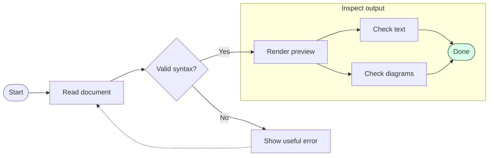

### Sequence diagram with a loop and alternatives

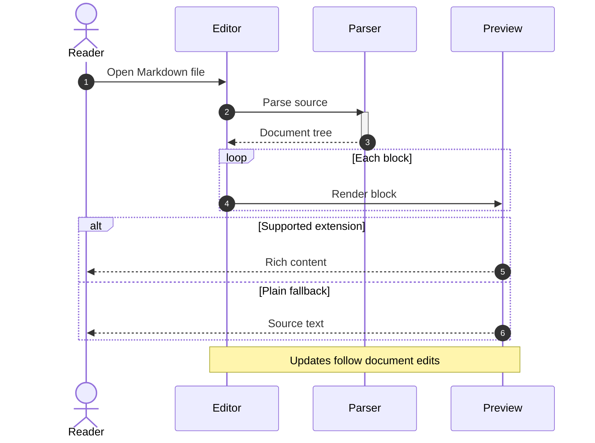

### Class diagram

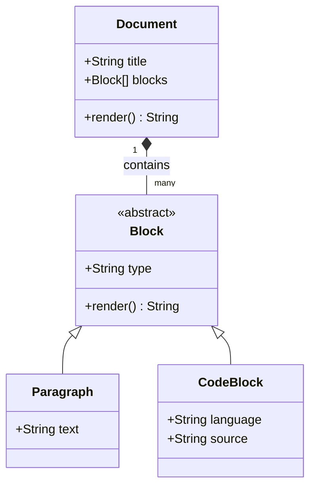

### State diagram with a composite state

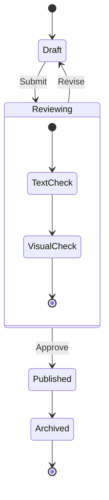

### Entity relationship diagram

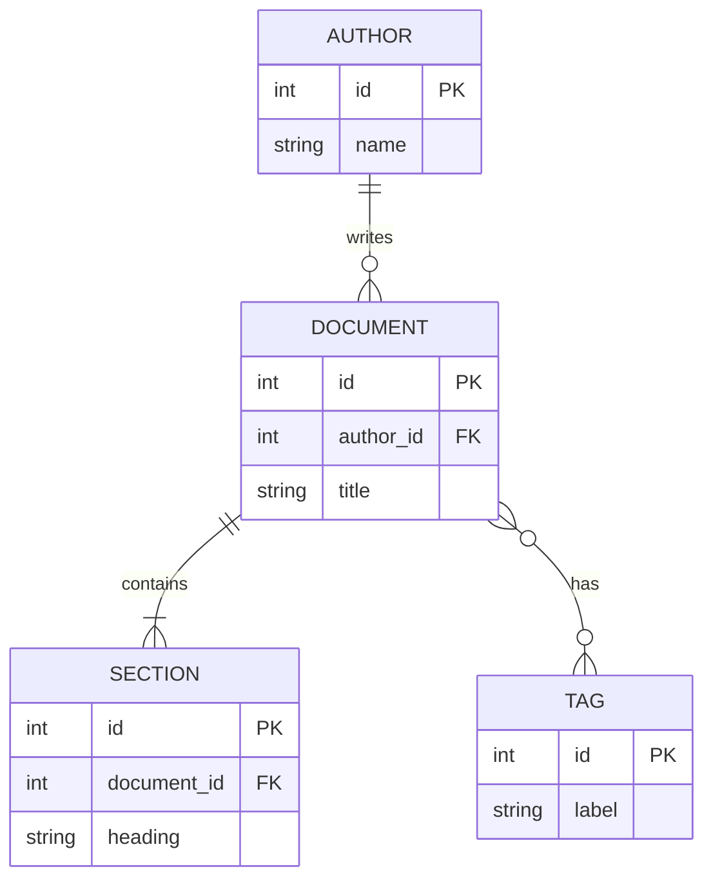

### Gantt chart

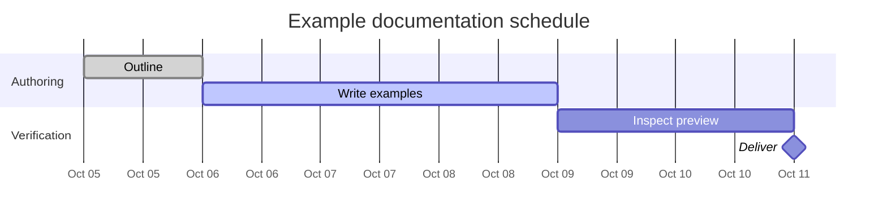

### Pie chart

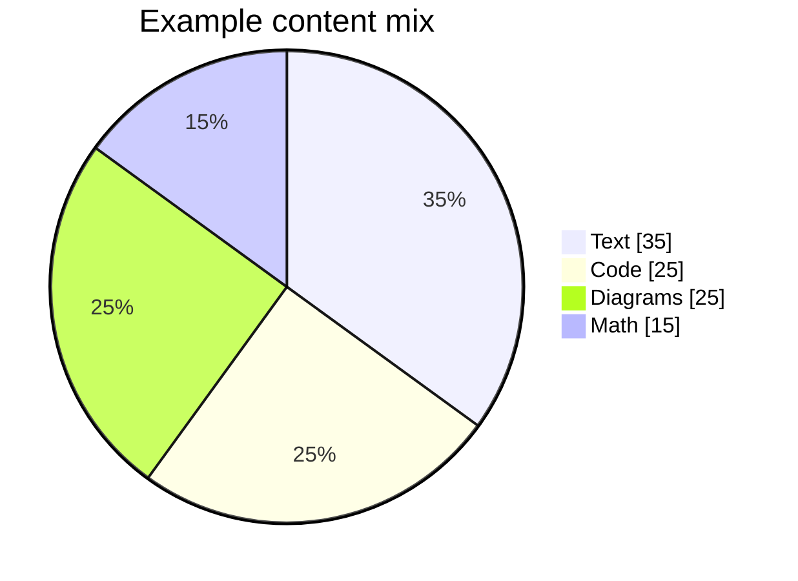

### User journey

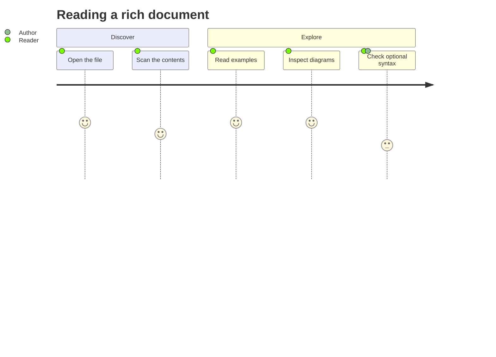

### Git graph

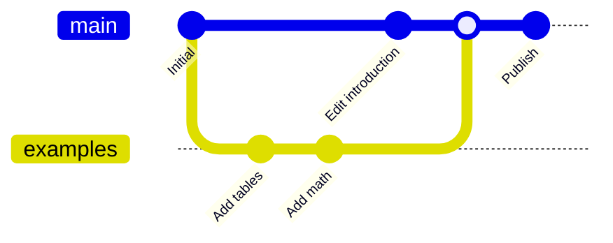

### Mind map

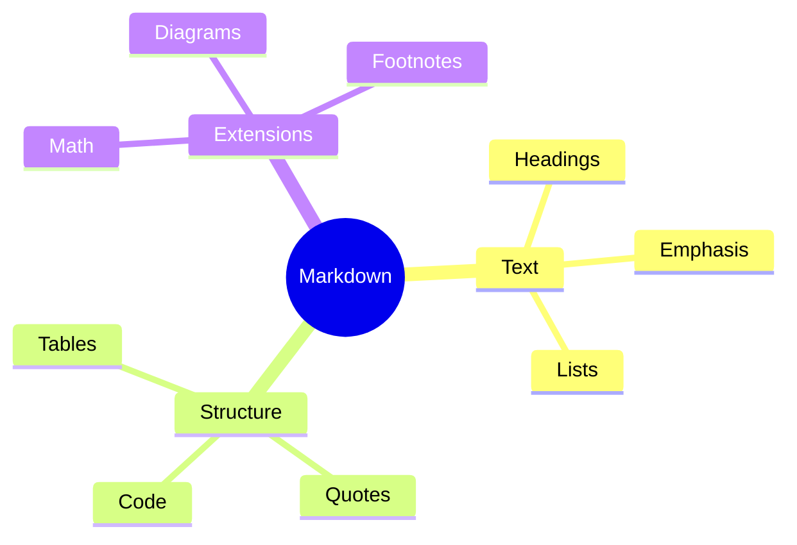

### Timeline

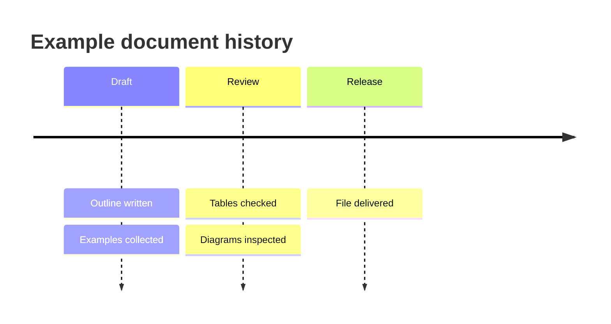

### Quadrant chart

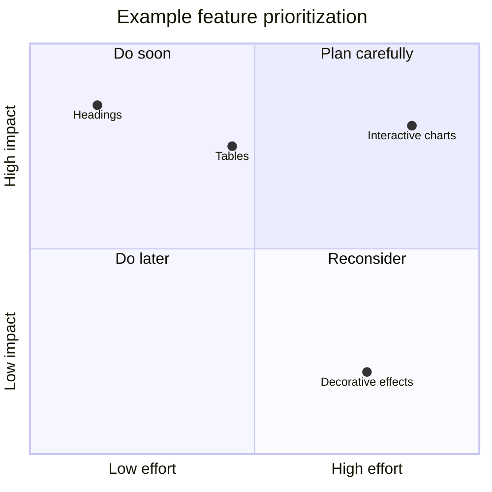

### XY chart

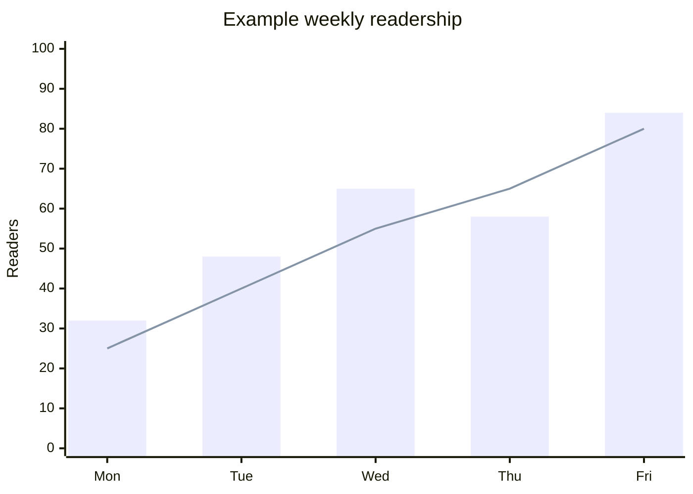

### Sankey diagram

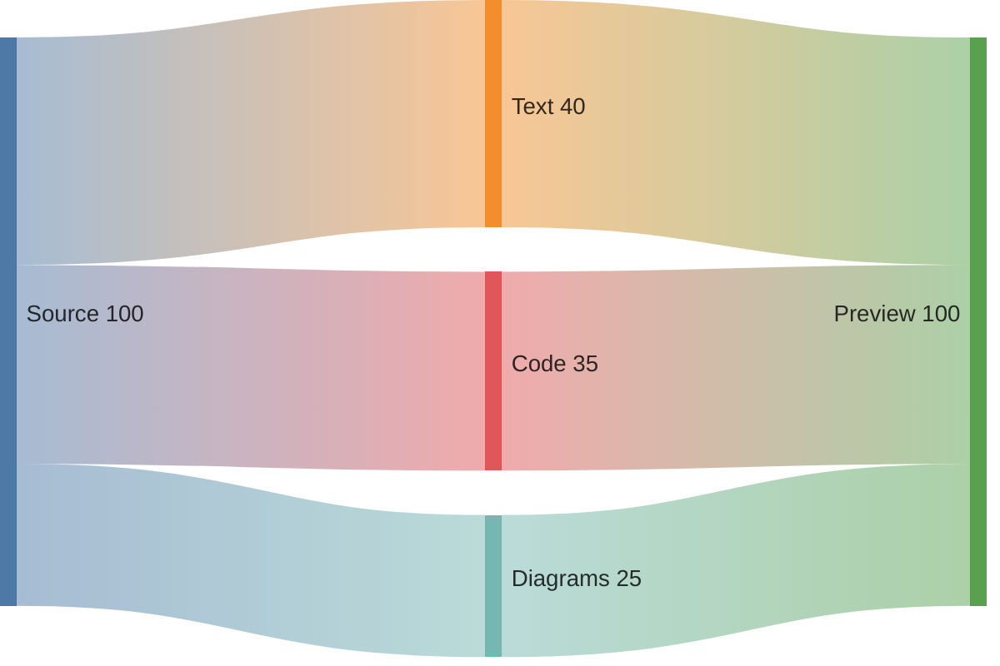

### Requirement diagram

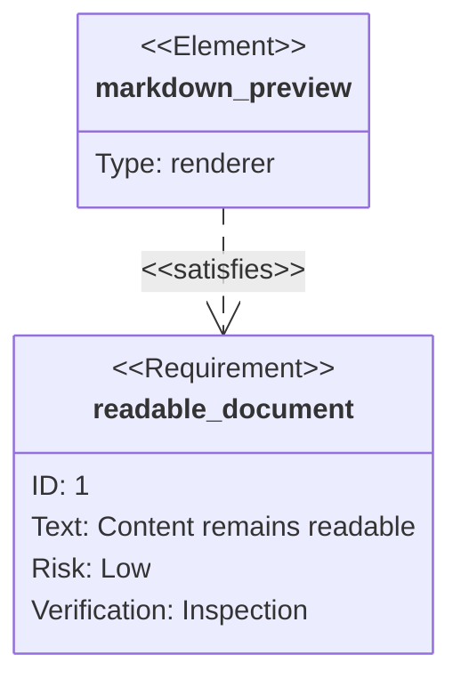

## Images and media

### Local image with alternative text and a title


### Reference-style image

![Reference image showing the same banner][sample-banner]

[sample-banner]: markdown-showcase-assets/sample.svg "Reference-style image title"

### Linked image

[](#images-and-media)

### HTML image sizing and figure caption, extension

<figure>
  
  <figcaption>A caption associated with an explicitly sized image.</figcaption>
</figure>

Audio and video have no core Markdown syntax. Here is an HTML embedding example shown as source, since this fixture does not include audio or video files:

```html
<audio controls src="sample.ogg">Audio playback unavailable.</audio>
<video controls width="640" poster="poster.png" src="sample.mp4">
  Video playback unavailable.
</video>
```

## Footnotes

This sentence has a short footnote.[^short]

This sentence has a longer footnote with several blocks.[^long]

The same short note can be referenced again.[^short] A named note can also appear in a table.[^measurement]

[^short]: A short footnote with **bold text** and an [example link](https://example.com).

[^long]: The first paragraph of a longer footnote.

    The second paragraph is indented to remain inside the note.

    - An item inside the footnote
    - Another item

    ```text
    A code block inside the footnote.
    ```

[^measurement]: Values in this file are sample data created solely to demonstrate rendering.

## HTML and disclosure widgets

Raw HTML may be allowed, sanitized, escaped, or omitted by the viewer. These specimens deliberately use simple, inert markup.

### Inline HTML

| Element | Live example |
| --- | --- |
| Keyboard keys | <kbd>⌘</kbd> + <kbd>K</kbd> |
| Highlight | <mark>Marked text</mark> |
| Subscript | H<sub>2</sub>O |
| Superscript | x<sup>2</sup> |
| Underline | <u>Underlined text</u> |
| Insertion | <ins>Inserted text</ins> |
| Deletion | <del>Deleted text</del> |
| Small print | <small>Small supporting text</small> |
| Abbreviation | <abbr title="HyperText Markup Language">HTML</abbr> |
| Sample output | <samp>Process completed</samp> |
| Variable | <var>x</var> |
| Date | <time datetime="2026-10-03">October 3, 2026</time> |

### Collapsed details

<details>
<summary>Expand a nested Markdown example</summary>

### Inside the disclosure

This contains **formatted text**, a list, a table, and a code block.

- First item
- Second item

| Key | Value |
| --- | --- |
| expanded | true |

```json
{ "details": "expanded" }
```

</details>

### Initially open details

<details open>
<summary>This disclosure starts expanded</summary>

The `open` attribute requests an initially expanded disclosure.

</details>

### HTML definition list

<dl>
  <dt>Parser</dt>
  <dd>Turns source text into a structured representation.</dd>
  <dt>Renderer</dt>
  <dd>Turns the structured representation into visible output.</dd>
</dl>

### HTML comment

There is an HTML comment between this paragraph and the next one.

<!-- This comment should be hidden in a renderer that recognizes HTML comments. -->

The comment text should be absent from the rendered view.

## Optional dialect extensions

The following are **dialect probes**, not universal Markdown. Literal punctuation or plain text is an acceptable indication that the relevant extension is absent.

### Highlight, subscript, and superscript shorthand

==Highlighted text==

Water: H~2~O. Squared: x^2^.

### Definition-list shorthand

Markdown
: A family of lightweight text markup syntaxes.

Renderer
: Software that turns source into visible content.
: This term has a second definition entry.

### Abbreviation definitions

The HTML and CSS abbreviation names may gain hover explanations.

*[HTML]: HyperText Markup Language
*[CSS]: Cascading Style Sheets

### Emoji shortcodes

:rocket: :white_check_mark: :sparkles: :warning: :tada:

### Automatic table of contents marker

[TOC]

### Attribute syntax

This paragraph requests a custom class in dialects with attribute lists.
{.sample-paragraph}

### Fenced container

::: note
A container-style note for dialects that support colon fences.
:::

### Pandoc-style grid table

+-------------+------------------------------+
| Feature     | Description                  |
+=============+==============================+
| Multiline   | A cell whose source text     |
| cell        | continues on a second line.  |
+-------------+------------------------------+
| Another row | Another value.               |
+-------------+------------------------------+

### Citation syntax

An example citation token [@sample2026, p. 12] needs a citation processor and bibliography to resolve. No bibliography is attached to this fixture.

### Other diagram fences

These need their own integrations; they are separate from Mermaid.

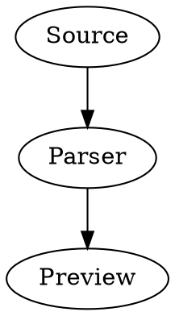

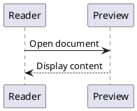

## Escaping and edge cases

### Escaped Markdown punctuation

\# This is not a heading.

\- This is not a list item.

1\. This is not an ordered list.

\> This is not a blockquote.

\*Not italic\* and \*\*not bold\*\*.

\[Not a link\]\(https://example.com\).

Backslash: \\. Backtick: \`. Braces: \{ \}. Pipe: \|.

### Literal HTML and currency

Escaped tags: &lt;section&gt;content&lt;/section&gt;.

Literal dollar amounts: \$5.00 and \$12.50. Code stays literal: `$HOME`, `${value}`, and `price = "$5"`.

### Intraword underscores

Names such as `snake_case_identifier` and unformatted snake_case_identifier should remain readable.

### International and bidirectional text

English: The document is ready.

日本語: Markdown の表示を確認します。

中文: 检查表格、公式和图表的显示效果。

한국어: 문서의 서식을 확인합니다.

العربية: هذا مثال لاختبار عرض النص.

עברית: זוהי דוגמה להצגת טקסט.

Accents and combining marks: café, naïve, Ångström, é, ñ.

### Long unbroken content

abcdefghijklmnopqrstuvwxyzABCDEFGHIJKLMNOPQRSTUVWXYZ0123456789abcdefghijklmnopqrstuvwxyzABCDEFGHIJKLMNOPQRSTUVWXYZ0123456789abcdefghijklmnopqrstuvwxyzABCDEFGHIJKLMNOPQRSTUVWXYZ0123456789

### Whitespace tree

```text
document/
├── README.md
├── sections/
│   ├── text.md
│   ├── math.md
│   └── diagrams.md
└── assets/
    └── sample.svg
```

## Combined rendering specimen

> [!NOTE]
> This final specimen combines several features in one small report.

### Example experiment

We compare **Variant A** and **Variant B** using the fictional observations below.[^measurement] The mean is $\bar{x}=\frac{1}{n}\sum_{i=1}^{n}x_i$.

| Variant | Samples | Mean | Change | Decision |
| :--- | ---: | ---: | ---: | :--- |
| A | 100 | 42.0 | Baseline | ~~Retain~~ |
| B | 100 | 38.5 | −8.3% | **Inspect** |

- [x] Collect sample data
- [x] Calculate the mean
- [ ] Inspect the viewer's rendering
  - [ ] Table alignment
  - [ ] Math baseline
  - [ ] Diagram layout

$$
\Delta = \frac{38.5-42.0}{42.0}\times100\% \approx -8.3\%.
$$

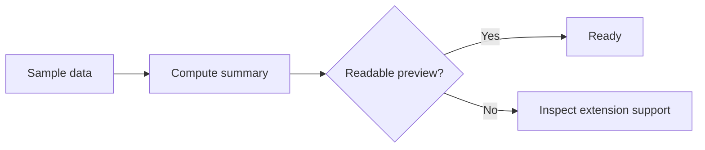

<details>
<summary>Show calculation source</summary>

```python
baseline = 42.0
candidate = 38.5
change = (candidate - baseline) / baseline * 100
print(f"{change:.1f}%")
```

</details>

[Back to the contents](#contents)
